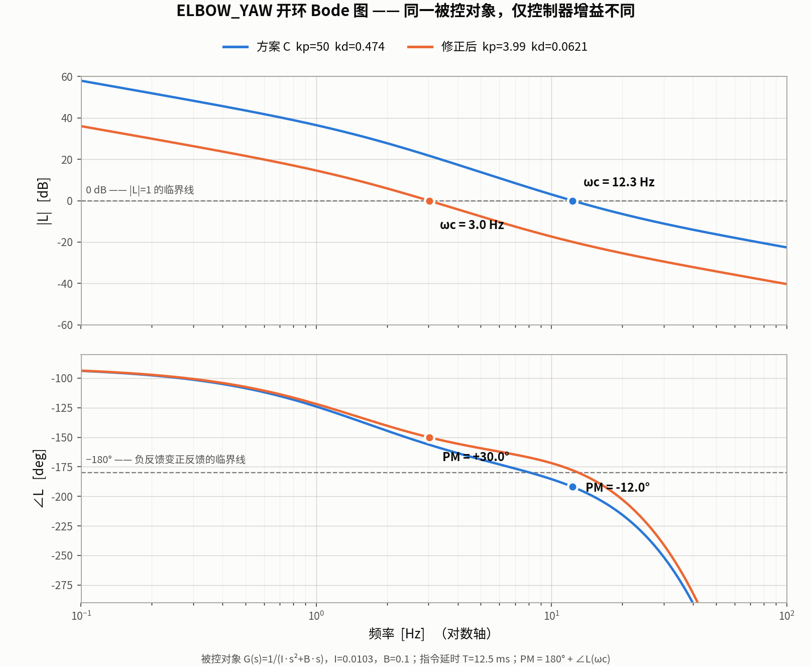

# 相位裕度与 Bode 图

以 S800 的 `ELBOW_YAW` 关节为实例，记录如何用开环 Bode 图判断闭环稳定性，
以及为什么**指令延时会给可达带宽设上限**。



## 一、Bode 图怎么看

两张图共享同一个**对数频率轴**：

| 面板 | 读什么 |
|---|---|
| 上 `\|L\|` [dB] | 信号绕环路一圈后，幅度变成原来的多少倍 |
| 下 `∠L` [deg] | 绕一圈后相位偏移了多少 |

两条参考线：

- **`0 dB`** = 幅度不增不减（环路增益为 1）
- **`−180°`** = 相位反相

反相意味着：本该"减去"的反馈变成了"加上" —— **负反馈变成正反馈**。

## 二、三步读出相位裕度

```
①  在上图找 |L| 穿过 0 dB 的频率        →  ωc（增益穿越频率）
②  垂直下到下图，读该频率处的相位
③  量它离 −180° 还有多远                →  PM = 180° + ∠L(ωc)
```

**判据**：

| PM | 表现 |
|---|---|
| > 60° | 无超调 |
| 30° ~ 45° | 有超调、轻微振铃 |
| < 15° | 剧烈振荡 |
| **< 0°** | **发散（自激振荡，频率 = ωc）** |

近似关系：`ζ ≈ PM/100`（PM 取角度）。PM = 40° 对应 ζ ≈ 0.4。

## 三、本项目的实例

被控对象 `G(s) = 1/(I·s² + B·s)`，`I = 0.0103`，`B = 0.1`；指令延时 `T = 12.5 ms`
（= `data_collection.py` 的 `time_lag = 5` 步 @ 400 Hz）。开环：

```
L(s) = (kp + kd·s)/(I·s² + B·s) · e^(−sT)
```

| 配置 | ωc | 该处相位 | PM | 结果 |
|---|---|---|---|---|
| kp=50, kd=0.474 | 12.3 Hz | −192° | **−12°** | ❌ 实测自激振荡，频率 12.5 Hz |
| kp=3.99, kd=0.0621 | 3.0 Hz | −150° | **+30°** | ✅ 稳定 |

**实测振荡频率 12.5 Hz 与预测的 ωc 12.3 Hz 吻合** —— 自激振荡就发生在增益穿越频率上。

## 四、两个推论

### 1. 低频段两条曲线重合 —— 控制器的话语权边界

0.1~1 Hz 区间两条曲线完全重叠，因为那里 `|L| ≫ 1`，相位由被控对象的 `1/(Is²)` 的
−180° 主导，kp 取多少无关紧要。**分离点（约 2~3 Hz）就是控制器能起作用的频率上限**，
低于它被控对象动力学占主导。

### 2. 高频段陡峭下坠 —— 延时的签名

纯延时 `e^(−sT)` 的相位是 `−ωT`，**随频率线性增长且无上限**。D 项的相位超前
`arctan(kd·ω/kp)` 最多趋近 +90°，补不回这条无上限的下坠。

所以相位裕度里各项是：

```
PM  =  arctan(kd·ωc/kp)     ← D 项提供的超前（有上限）
     + arctan(B/(I·ωc))     ← 粘性摩擦
     −  ωc·T                ← 延时滞后（无上限，随 ωc 线性增长）
```

**kp 抬高 → ωc 抬高 → 延时滞后 `ωc·T` 线性增长 → 吃掉 D 项提供的相位裕度。**
在本项目 `T = 12.5 ms` 下，维持 PM ≥ 30° 要求 `ωc ≲ 7.8 Hz` —— **这是可达带宽的硬上限。**

## 五、对激励设计的含义

PACE 原文（p.7）指出：闭环极点 `ω_cl = sqrt(kp/I_total)` 应落在 chirp 带内，
否则关节全程紧跟参考、跟踪误差 `e ≈ J·q̈_des/kp` 过小，armature 不可辨识。

这与上面的延时约束**方向一致** —— 两者都要求降低 kp：

```
降 kp  →  ω_cl 落回 chirp 带内（可辨识性）
       →  ωc 下降，延时滞后变小，PM 升高（稳定性）
```

反过来，照搬真机部署的高 kp 会让轻惯量关节越界。本项目实测：直接采用部署值
（`kpkd_params.py`）时，`ELBOW_YAW` 的 PM = −12°、`SHOULDER_YAW` 9.2°、
`ANKLE_ROLL` 8.3°，表现为无预警的自激振荡（`ELBOW_YAW` 平均角速度 16 rad/s，
是其余关节的 5~10 倍）。

因此 `s800_pace_env_cfg.py` 中 5 个轻惯量关节的 kp 被下调到 PM = 30°，
其余 9 类保留部署值。

## 复现

```bash
# 闭环极点 ω_cl / ζ（二阶模型，不含延时）
python scripts/frequency_damping_ratio_calculate.py --mode itotal

# 本文的图：开环 Bode 图 + 相位裕度（含延时）—— 默认输出 ELBOW_YAW 实例
python scripts/bode_phase_margin.py

# 换关节 / 换增益
python scripts/bode_phase_margin.py --joint HIP_YAW \
    --kp1 113 --kd1 3.2 --kp2 35.11 --kd2 0.3885 \
    --out /tmp/bode_hip_yaw.png
```

两个脚本职责不同，要配合看：

| 脚本 | 覆盖 | 回答的问题 |
|---|---|---|
| `frequency_damping_ratio_calculate.py` | 无延时 | 极点 `ω_cl` 是否落在 chirp 带内（可辨识性） |
| `bode_phase_margin.py` | 含延时 | 相位裕度是否为正（稳定性） |

**只看前者会漏掉延时这个约束** —— 这正是本项目踩过的坑。
